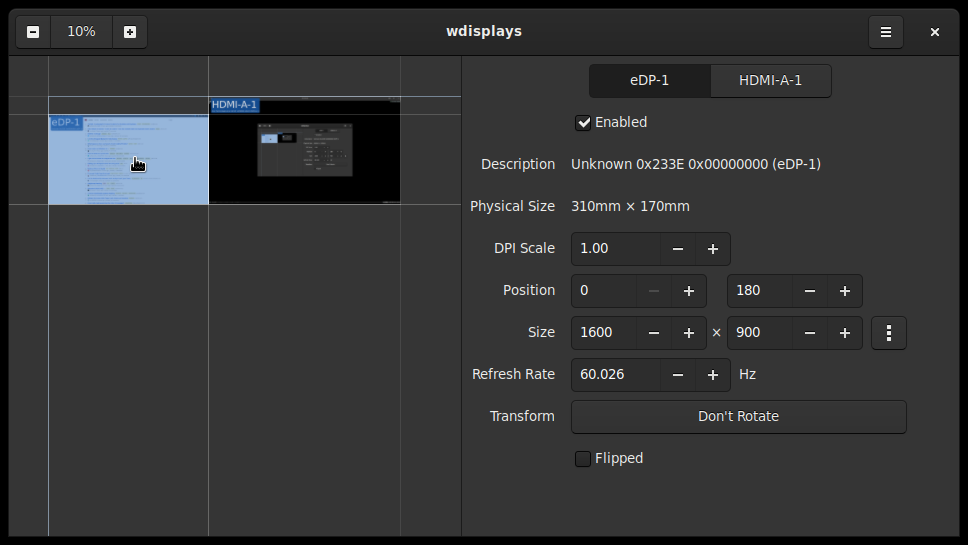

# wdisplays

[![License: GPL 3.0 or later][license-img]][license-spdx]

wdisplays is a graphical application for configuring displays in Wayland
compositors. It borrows some code from [kanshi]. It should work in any
compositor that implements the wlr-output-management-unstable-v1 protocol.
Compositors that are known to support the protocol are [Sway] and [Wayfire].
The goal of this project is to allow precise adjustment of display settings in
kiosks, digital signage, and other elaborate multi-monitor setups.



# Installation

[![Repology][repology-img]][repology-pkg]

Check your distro for a `wdisplays` package. Known distro packages:

- [Alpine](https://pkgs.alpinelinux.org/package/edge/testing/x86_64/wdisplays)
- [Arch](https://aur.archlinux.org/packages/wdisplays-git/)
- [Debian](https://packages.debian.org/sid/wdisplays)
- [Fedora](https://copr.fedorainfracloud.org/coprs/wef/wdisplays/)
- [FreeBSD](https://svnweb.freebsd.org/ports/head/x11/wdisplays/)
- [Nix](https://github.com/NixOS/nixpkgs/tree/master/pkgs/tools/graphics/wdisplays)
- [OpenSUSE](https://build.opensuse.org/package/show/home%3AMWh3/wdisplays)

# Building

Build requirements are:

- meson
- GTK+3
- epoxy
- wayland-client

```sh
meson build
ninja -C build
sudo ninja -C build install
```

# Usage

Displays can be moved around the virtual screen space by clicking and dragging
them in the preview on the left panel. By default, they will snap to one
another. Hold Shift while dragging to disable snapping. You can click and drag
with the middle mouse button to pan. Zoom in and out either with the buttons on
the top left, or by holding Ctrl and scrolling the mouse wheel. Fine tune your
adjustments in the right panel, then click apply.

There are some options available by clicking the menu button on the top left:

- Automatically Apply Changes: Makes it so you don't have to hit apply. Disable
  this for making minor adjustments, but be careful, you may end up with an
  unusable setup.
- Show Screen Contents: Shows a live preview of the screens in the left panel.
  Turn off to reduce energy usage.
- Overlay Screen Names: Shows big names in the corner of all screens for easy
  identification. Disable if they get in the way.

# FAQ

### What is this?

It's intended to be the Wayland equivalent of an xrandr GUI, like [ARandR].

### I'm using Sway, why aren't my display settings saved when I log out?

Sway, like i3, doesn't save any settings unless you put them in the config
file. See man `sway-output`. If you want to have multiple configurations
depending on the monitors connected, you'll need to use an external program
like [kanshi]. Integration with that and other external daemons is planned.

### How do I add support to my compositor?

A minimal amount of code (approximately 150-200 LOC) is currently required to
get support for this in wlroots compositors. See the diff here for a sample
implementation on top of tinywl: [tinywl-output-management].

[kanshi]: https://github.com/emersion/kanshi
[Sway]: https://swaywm.org
[Wayfire]: https://wayfire.org
[ARandR]: https://christian.amsuess.com/tools/arandr/
[tinywl-output-management]: https://git.sr.ht/~jf/tinywl-output-management/commit/87a45d89ae0e7975e2a59f84e960380dd2f5ac08

[license-img]:  https://img.shields.io/badge/License-GPL%203.0%20or%20later-blue.svg?logo=gnu
[license-spdx]: https://spdx.org/licenses/GPL-3.0-or-later.html
[repology-img]: https://repology.org/badge/tiny-repos/wdisplays.svg
[repology-pkg]: https://repology.org/project/wdisplays/versions
